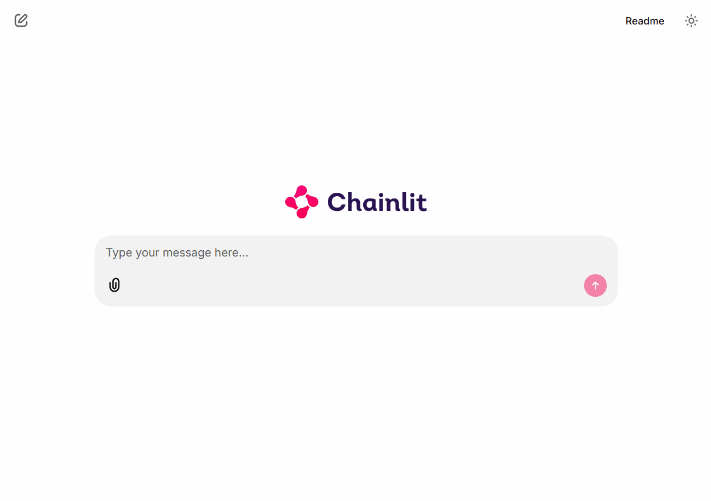

# Kubernetes AI Ops Agent

An AI-powered assistant for Kubernetes operations and management through natural language interactions.

## Overview

Kubernetes AI Ops Agent is an intelligent agent that helps DevOps engineers and Kubernetes administrators manage Kubernetes clusters through conversational interfaces. The project leverages Large Language Models (LLMs) to interpret user intents and execute Kubernetes operations using specialized MCP (Model Context Protocol) servers.



## Project Status

**Note**: This project is currently in an experimental stage. It serves primarily as a proof of concept to validate the capabilities and potential benefits of integrating Large Language Models (LLMs) with Kubernetes, Prometheus, and other MCP (Model Context Protocol) servers. Features and functionality may change significantly as the project evolves.

## Features

- 🤖 **AI-Powered Assistance**: Interact with your Kubernetes clusters using natural language
- 🧰 **Tool Integration**: Execute Kubernetes operations through specialized tools
- 🚀 **Deployment Ready**: Packaged with Docker and Helm charts for easy deployment
- 📊 **Web Interface**: Built with Chainlit for an interactive chat experience

## Prerequisites

- Python 3.10+
- Docker
- Kubernetes cluster access
- Helm (for deployment)

## Installation

### Local Development

1. Clone the repository:
   ```bash
   git clone https://github.com/yourusername/kubernetes-ai-ops-agent.git
   cd kubernetes-ai-ops-agent
   ```

2. Install the dependencies:
   ```bash
   pip install -r requirements.txt
   ```

3. Install the required MCP servers:
   ```bash
   # Install the Kubernetes MCP server
   npm install -g @kubernetes-ai/mcp-server-kubernetes

   # Install the Prometheus MCP server
   pip install prometheus-mcp-server
   ```

   > **Note**: Do not use the MCP servers located in the `deps/` directory for local development. These are customized versions:
   > - The Kubernetes MCP server in `deps/` is modified to use `loadFromCluster` for proper initialization in a Pod environment.
   > - The MCP servers in `deps/` are included to be packaged directly into the container image rather than downloaded at runtime.

4. Configure your Kubernetes access:
   - Ensure your kubeconfig is properly set up
   - The agent will use your current kubectl context

5. Start the application:
   ```bash
   chainlit run src/main.py
   ```

### Helm Chart Deployment

1. Build and push the Docker image:

```bash
# Build the Docker image
docker build -t <YOUR_CONTAINER_REGISTRY>/kubernetes-ai-ops-agent:<TAG> .

# Push the image to your container registry
docker push <YOUR_CONTAINER_REGISTRY>/kubernetes-ai-ops-agent:<TAG>
```

2. Create a `customized.values.yaml` file with your specific configuration:

```yaml
# Customized values for kubernetes-ai-ops-agent
image:
  repository: <YOUR_CONTAINER_REGISTRY>/kubernetes-ai-ops-agent

# Configure the secrets
secrets:
  data:
    # Option 1: For Azure OpenAI configuration
    AZURE_OPENAI_ENDPOINT: "https://<YOUR_OPENAI_SERVICE>.openai.azure.com/"
    AZURE_OPENAI_API_KEY: "<YOUR_AZURE_OPENAI_API_KEY>"
    AZURE_OPENAI_MODEL: "<YOUR_DEPLOYMENT_NAME>"
    OPENAI_API_VERSION: "<API_VERSION>"
    
    # Option 2: For standard OpenAI configuration
    # OPENAI_API_KEY: "<YOUR_OPENAI_API_KEY>"
    # OPENAI_MODEL: "<YOUR_MODEL_NAME>" # e.g., "gpt-4o"
    
    # Prometheus configuration
    PROMETHEUS_URL: "http://<YOUR_PROMETHEUS_SERVICE>.<NAMESPACE>:9090"
```

3. Install the chart using your customized values:

```bash
cd deploy/helm
helm install kubernetes-ai-ops ./kubernetes-ai-ops-agent -f customized.values.yaml
```

## Architecture

The application is built with the following components:

- **Chainlit Interface**: Web UI for interacting with the AI assistant
- **Agent Layer**: Processes natural language, plans operations, and executes them
- **MCP Servers**:
  - **Kubernetes MCP Server**: Handles Kubernetes API operations
  - **Prometheus MCP Server**: Provides monitoring metrics and data

## Model Support

This project currently supports only OpenAI models. You can configure the agent to use either:
- OpenAI API directly
- Azure OpenAI API

Configuration details for both options are provided in the deployment settings.

## Usage Examples

### Basic Cluster Information
```
User: "Show me all pods in the default namespace"
```

### Troubleshooting
```
User: "Why is my pod in CrashLoopBackOff state?"
```

## Project Structure

- `src/`: Main application code
  - `main.py`: Main entry point for the Chainlit application
  - `chainlit_session_manager.py`: Manages Chainlit user sessions
  - `chainlit_session_storage.py`: Handles session data storage
  - `interfaces.py`: Defines interfaces and abstractions
  - `kubernetes_ai_ops_agent_provider.py`: Provider implementation for Kubernetes operations
  - `mcp_server_provider_impl.py`: Implementation for MCP server provider
  - `openai_client_factory_impl.py`: Factory for OpenAI client configuration
- `deps/`: Dependencies and MCP servers
  - `mcp-server-kubernetes/`: Kubernetes MCP server
  - `prometheus-mcp-server/`: Prometheus MCP server
- `deploy/`: Deployment configurations
  - `helm/`: Helm charts for Kubernetes deployment

## Contributing

Contributions are welcome! Please see [CONTRIBUTING.md](CONTRIBUTING.md) for guidelines.

## License

This project is licensed under the MIT License - see the [LICENSE](LICENSE) file for details.